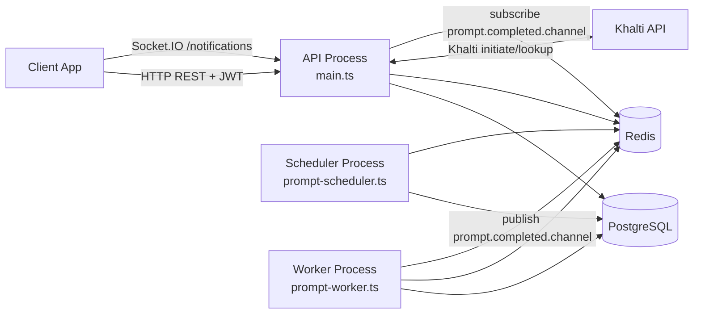
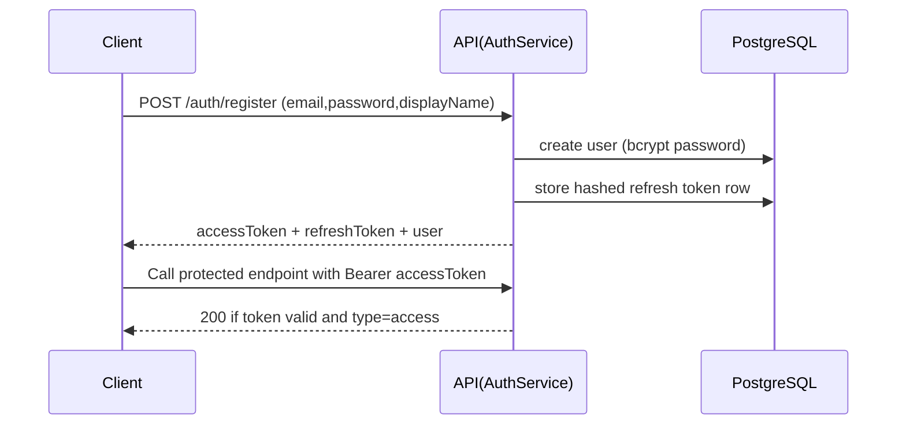
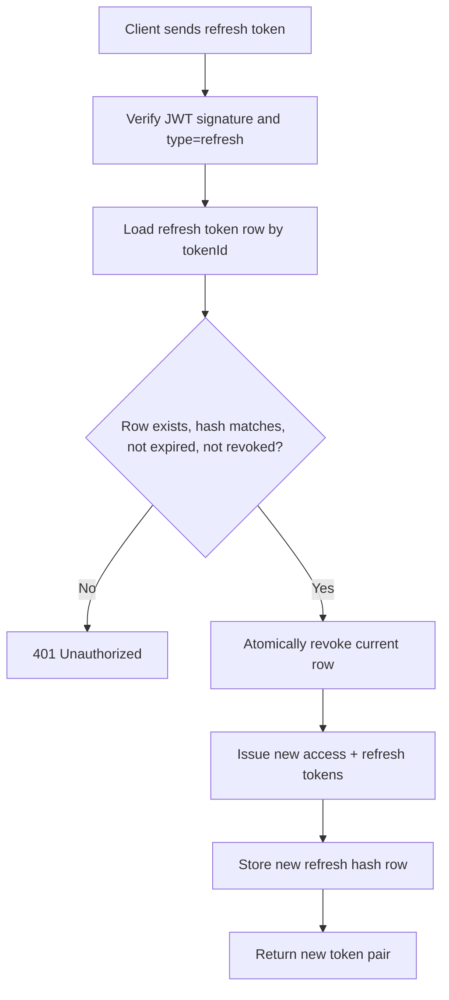
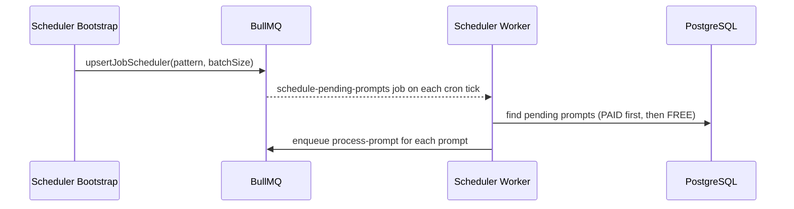
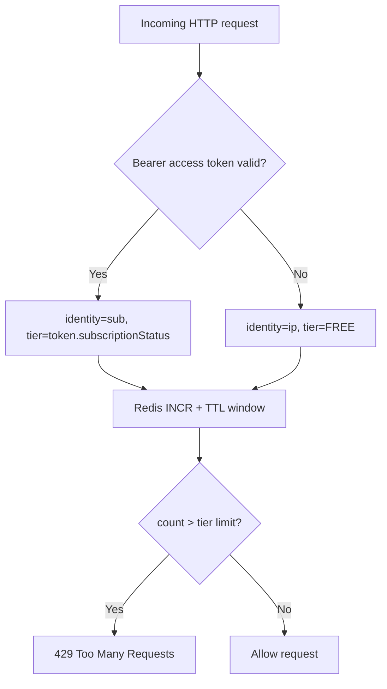
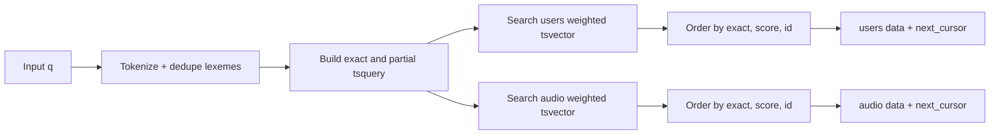
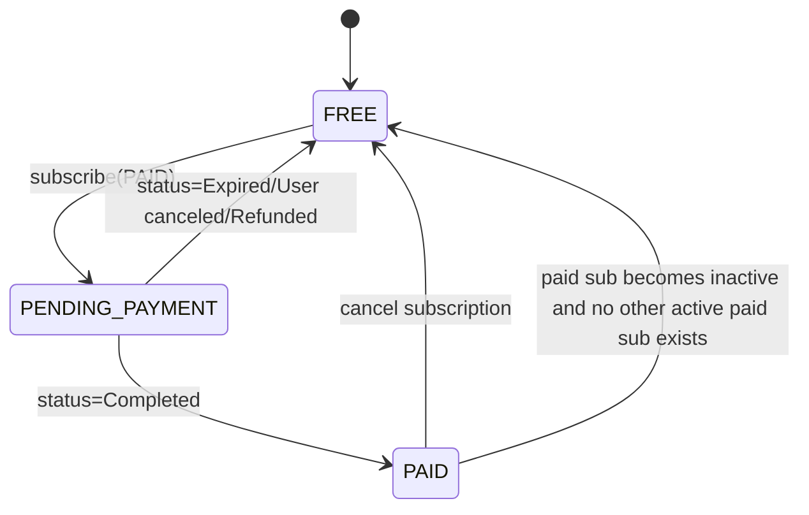

# Self Backend

NestJS backend for authentication, paid subscriptions, prompt-to-audio job processing, realtime prompt completion notifications, and unified full-text search.

## Summary of Architecture

This system runs as three cooperative processes:

- API process: REST endpoints, auth, rate limiting, user/audio/search APIs, subscription APIs, and Socket.IO notifications.
- Scheduler process: cron-driven scanner that finds pending prompts and enqueues processing jobs.
- Worker process: consumes queued prompt jobs, simulates generation, creates audio rows, and publishes realtime events.

Primary infrastructure:

- PostgreSQL: source of truth for users, tokens, subscriptions, prompts, audio.
- Redis: rate-limit counters, short-lived API cache, BullMQ transport, pub/sub for realtime prompt completion.



## How to Run with Docker

Two compose files are included:

- `docker-compose.dev.yml`: local development (source mounted, hot reload API).
- `docker-compose.prod.yml`: production-style containers (compiled build, no source mounts).

### 1. Development Stack

```bash
docker compose -f docker-compose.dev.yml up --build
```

Starts:

- `api` on `http://localhost:${PORT:-3000}`
- `scheduler`
- `worker`
- `postgres`
- `redis`
- one-shot `migrate` service (`prisma migrate deploy`) before app services

Stop:

```bash
docker compose -f docker-compose.dev.yml down
```

### 2. Production-style Stack

```bash
docker compose -f docker-compose.prod.yml up --build -d
```

Stop:

```bash
docker compose -f docker-compose.prod.yml down
```

### Docker Notes

- Compose overrides `DATABASE_URL` and `REDIS_URL` to use service hosts (`postgres`, `redis`).
- Dev mode mounts the repo into `/app` and keeps dependencies in a named volume.
- API docs are available at `/docs` once the API is up.

## How to Run Locally

### Prerequisites

- Node.js 22+
- npm 10+
- PostgreSQL 16+
- Redis 7+

### 1. Start dependencies

Option A (recommended): use the infra-only compose file:

```bash
docker compose up -d
```

Option B: run PostgreSQL and Redis manually.

### 2. Install and prepare

```bash
npm install
npx prisma generate
npx prisma migrate deploy
```

### 3. Run processes (3 terminals)

Terminal 1 (API):

```bash
npm run start:dev
```

Terminal 2 (scheduler):

```bash
npm run start:scheduler
```

Terminal 3 (worker):

```bash
npm run start:worker
```

### 4. Verify

- API base: `http://localhost:3000`
- Swagger docs: `http://localhost:3000/docs`
- Realtime namespace: `ws://localhost:3000/notifications`

## Environment Variables

The table below reflects values used by code (with defaults from code paths where available).

### Core

| Variable | Required | Default | Purpose |
|---|---|---|---|
| `PORT` | No | `3000` | API listen port (`main.ts`). |
| `DATABASE_URL` | Yes | None | PostgreSQL connection string for Prisma. |
| `REDIS_URL` | No | `redis://localhost:6379` | Redis connection for cache, rate-limits, BullMQ, pub/sub. |

### Auth and Tokens

| Variable | Required | Default | Purpose |
|---|---|---|---|
| `JWT_ACCESS_SECRET` | Yes | None | Access token signing/verification secret. |
| `JWT_REFRESH_SECRET` | Yes | None | Refresh token signing/verification secret. |
| `ACCESS_TOKEN_TTL` | No | `15m` | Access token lifetime (`s/m/h/d` format). |
| `REFRESH_TOKEN_TTL` | No | `7d` | Refresh token lifetime (`s/m/h/d` format). |

### Rate Limiting

| Variable | Required | Default | Purpose |
|---|---|---|---|
| `RATE_LIMIT_WINDOW_SECONDS` | No | `60` | Rate-limit window size in seconds. |
| `RATE_LIMIT_FREE_LIMIT` | No | `30` | FREE plan max requests per window. |
| `RATE_LIMIT_PAID_LIMIT` | No | `120` | PAID plan max requests per window. |

### Prompt Queue and Scheduler

| Variable | Required | Default | Purpose |
|---|---|---|---|
| `PROMPT_SCHEDULER_CRON` | No | `*/15 * * * * *` | Cron expression for scheduler ticks. |
| `PROMPT_SCHEDULER_BATCH_SIZE` | No | `25` | Max pending prompts picked per scheduler tick. |
| `PROMPT_PROCESSING_DELAY_MS` | No | `5000` | Simulated worker processing delay. |
| `PROMPT_AUDIO_URL` | No | `/audios/processed-prompt.mp3` | URL stored in generated audio records. |

### Subscription / Khalti

| Variable | Required | Default | Purpose |
|---|---|---|---|
| `KHALTI_LIVE_SECRET_KEY` | Yes (for subscription APIs) | None | Server-side Khalti auth key for initiate/lookup calls. |
| `KHALTI_BASE_URL` | No | `https://dev.khalti.com/api/v2/` | Khalti base URL used to build API endpoint URLs. |
| `KHALTI_PAID_PLAN_AMOUNT` | Yes (for subscribe) | None | Plan amount in paisa; must be integer `>= 1000`. |
| `KHALTI_PAID_PLAN_NAME` | No | `Paid Subscription` | Display name sent to Khalti during initiation. |
| `BACKEND_FQDN` | Yes (for subscribe) | None | Used to derive `website_url` and `return_url`. |
| `WEBSITE_URL` | Conditional fallback | None | Fallback if `BACKEND_FQDN` is not set. |
| `KHALTI_LIVE_PUBLIC_KEY` | No | None | Currently not read by backend code (useful for clients). |

### Docker Compose Overrides

These are used by compose files for infra defaults:

- `POSTGRES_USER` (default: `postgres`)
- `POSTGRES_PASSWORD` (default: `postgres`)
- `POSTGRES_DB` (default: `musicgpt`)
- `POSTGRES_PORT` (default: `5432`, dev compose)
- `REDIS_PORT` (default: `6379`, dev compose)

## Authentication Flow

- `POST /auth/register`: creates user, returns user profile + access token + refresh token.
- `POST /auth/login`: verifies credentials, returns access token only.
- `POST /auth/refresh`: verifies and rotates refresh token, returns new access + refresh pair.
- `POST /auth/logout`: verifies refresh token and revokes it.
- Protected REST routes use bearer access token via `AuthGuard`.
- Exception: `GET /subscription/status` is intentionally open (no auth guard) and syncs payment status using `pidx`.
- Socket.IO `/notifications` accepts access token in `handshake.auth.token` or `Authorization: Bearer <token>` header.



## Token Rotation / Invalidation Strategy

Refresh tokens are stateful and stored in DB as SHA-256 hashes (`refresh_tokens` table).

Rules implemented:

- On issue: refresh JWT includes `tokenId`, and hashed token is saved with `expiresAt`.
- On refresh:
  - verify JWT signature + `type=refresh`
  - fetch DB row by `tokenId`
  - compare hash
  - require `revokedAt` is null and `expiresAt` still valid
  - atomically revoke current row (`revokeIfActive`)
  - issue brand new access + refresh tokens
- On logout:
  - verify refresh token and hash
  - set `revokedAt` for that token row
- Invalid refresh conditions: unknown token id, hash mismatch, expired row, already revoked row, invalid signature.

Access tokens are stateless JWTs and remain valid until expiry; logout/refresh revocation affects refresh tokens, not already-issued access tokens.



## Job Queue Processing Flow

- `POST /prompts` creates prompt as `PENDING` only.
- Scheduler cron job periodically picks pending prompts and enqueues processing jobs.
- Worker consumes jobs, transitions prompt status, creates audio row, and publishes realtime completion event.

```mermaid
flowchart LR
  C[Client POST /prompts] --> P[(Prompt row: PENDING)]
  P --> S[Scheduler tick]
  S --> Q[Enqueue process-prompt job]
  Q --> W[Worker consumes job]
  W --> M[markProcessing CAS update]
  M --> D[simulate delay]
  D --> A[create audio if missing]
  A --> X[mark COMPLETED]
  X --> R[publish prompt.completed.channel]
  R --> N[API Redis subscriber]
  N --> WS[Socket.IO event prompt.completed]
```



Key queue behavior:

- Processing queue jobs use `jobId=prompt-<promptId>` for idempotent enqueueing.
- Retry: `attempts=3`, exponential backoff starting at 2s.
- Worker concurrency: `5`.
- Scheduler worker concurrency: `1`.

## Cron Scheduler Explanation

At scheduler-process boot:

- `registerScheduler()` calls BullMQ `upsertJobScheduler` with id `prompt-scheduler-cron`.
- Cron pattern comes from `PROMPT_SCHEDULER_CRON` (default every 15 seconds).
- Each cron fire creates a `schedule-pending-prompts` job containing `batchSize`.

On each run:

- Scheduler loads up to `batchSize` pending prompts.
- Selection policy: oldest PAID prompts first, then oldest FREE prompts.
- Each selected prompt is enqueued into processing queue with priority based on tier.



## Cache Strategy & Invalidation Rules

Current cache is Redis-based and read-through with short TTL.

Cached reads:

- `GET /users` list pages (`users:cursor=<cursor>:limit=<limit>`)
- `GET /users/:id` (`users:id=<id>`)
- `GET /audio` list pages (`audio:user=<userId>:cursor=<cursor>:limit=<limit>`)
- `GET /audio/:id` (`audio:user=<userId>:id=<audioId>`)

Cache TTL:

- 60 seconds for all cached endpoints.

Invalidation:

- `PUT /users/:id` deletes only `users:id=<id>`.
- `PUT /audio/:id` deletes only `audio:user=<userId>:id=<audioId>`.
- List caches are not proactively invalidated; they expire naturally by TTL.

Not cached currently:

- Auth endpoints
- Search endpoint
- Prompt submit lifecycle
- Subscription APIs

## Rate Limit Logic

Rate limiting is enforced by `SubscriptionRateLimitGuard` using Redis counters.

Algorithm:

1. Resolve identity:
   - valid access token -> identity key = `sub`, tier from token `subscriptionStatus`
   - missing/invalid token -> identity key = IP address, tier = `FREE`
2. Build key: `rate-limit:<tier>:<identity>`
3. `INCR` key and apply/maintain TTL window
4. Compare count to plan limit
5. Return `429` when exceeded

Response headers set on each request:

- `X-RateLimit-Limit`
- `X-RateLimit-Remaining`
- `X-RateLimit-Reset`

Important nuance:

- Tier for rate limiting comes from access token claims. After a plan change, a newly issued access token is needed for immediate limit changes.



## Unified Search Ranking Logic

Endpoint: `GET /search?q=<query>&limit=<n>&users_cursor=<id>&audio_cursor=<id>`

Behavior:

- Requires non-empty `q`.
- Query normalized into unique lowercase lexemes (`[letters|numbers|_]`).
- Two tsqueries are built:
  - exact: `lex1 & lex2 & ...`
  - partial: `lex1:* | lex2:* | ...`
- Users and audio buckets are searched independently and in parallel.

Ranking model:

- Filter: row must match partial query.
- `is_exact`: whether weighted vector matches exact query.
- Score:
  - exact match -> `ts_rank_cd(vector, exact_query, 32)`
  - else -> `ts_rank_cd(vector, partial_query, 32)`
- Ordering (both buckets):
  1. `is_exact DESC`
  2. `fts_score DESC`
  3. `id ASC`

Field weights:

- Users: `display_name` weight `A`, `email` weight `B`
- Audio: `title` weight `A`, `prompt.text` weight `B`

Pagination:

- Independent cursors per bucket (`users_cursor`, `audio_cursor`)
- `limit` applies per bucket (not globally)



## Subscription Perks Logic

Plans:

- `FREE`
- `PAID`

Perks tied to plan:

- Higher HTTP rate-limit ceiling for `PAID` users.
- Priority prompt scheduling:
  - scheduler pulls PAID pending prompts first
  - queue priority value favors PAID (`1`) over FREE (`10`)

Lifecycle summary:

- `POST /subscription/subscribe` (authenticated endpoint; `type` must be `PAID`): creates Khalti payment session and stores initiated subscription.
- `GET /subscription/status?pidx=...` (open endpoint): syncs payment gateway status and updates DB + effective user tier.
- `POST /subscription/cancel`: marks active subscription inactive and sets user tier back to `FREE`.

Status sync rules:

- Gateway status `Completed` -> activate subscription, set user `PAID`, deactivate other active paid records.
- Gateway statuses in `Expired`, `User canceled`, `Refunded`, `Partially Refunded` -> mark inactive; if no active paid subscription remains, set user `FREE`.



## Additional Notes

- Swagger/OpenAPI docs are served at `/docs`.
- Prompt completion realtime event is emitted as `prompt.completed` in namespace `/notifications` and scoped to user-specific rooms.
- Static files under `public/` are served by the API process.

## Postman Links

Socket.IO requests in Postman are not included when exporting a collection as JSON, so they are shared via Postman workspace links instead.

- REST collection: https://restless-satellite-886057.postman.co/workspace/Random~00ba3cbb-4740-4176-8868-4c7e8b40b16e/collection/69c27eb041935ebe6166d776?action=share&creator=30139296&active-environment=30139296-2ad2c983-4a5c-4302-82ae-06c99d443fa4
- Socket.IO-enabled collection/workspace share: https://restless-satellite-886057.postman.co/workspace/Random~00ba3cbb-4740-4176-8868-4c7e8b40b16e/collection/30139296-b597462f-02bb-45f7-9b3a-b82369a6d70d?action=share&creator=30139296&active-environment=30139296-2ad2c983-4a5c-4302-82ae-06c99d443fa4
